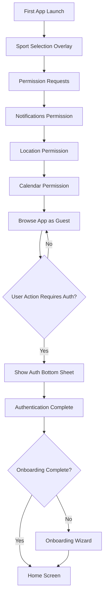

# 01 - Authentication & Onboarding

> User entry point: sign-in, sport selection, and profile creation.

## Overview

This system handles the complete user onboarding journey from first app launch to a fully configured player profile. It establishes the foundation for all subsequent user interactions.

## User Journey Flow

**Key Points:**

- Sport selection happens immediately on first launch (pre-authentication)
- Permission requests (notifications, location, calendar) follow sport selection back-to-back
- Users can browse most features without authentication
- Authentication is only required for critical actions
- Onboarding wizard appears after authentication if incomplete

## Sub-documents

| Document                                 | Description                                                                    |
| ---------------------------------------- | ------------------------------------------------------------------------------ |
| [sign-in-log-in.md](./sign-in-log-in.md) | Authentication methods and flows (bottom sheet modal, social login, email OTP) |
| [pre-onboarding.md](./pre-onboarding.md) | Initial sport selection overlay (pre-auth) and sport selection architecture    |
| [onboarding.md](./onboarding.md)         | Full profile creation wizard (5-step progressive flow)                         |

## User Stories

- As a new user, I want to sign up quickly using my existing social accounts
- As a new user, I want to select which sport(s) I play so I see relevant content
- As a new user, I want to complete my profile so other players can find me

## Dependencies

| System                                            | Relationship                                             |
| ------------------------------------------------- | -------------------------------------------------------- |
| [02 Sport Modes](../02-sport-modes/README.md)     | Receives sport selection to initialize correct interface |
| [04 Player Rating](../04-player-rating/README.md) | Collects initial self-declared skill level               |

## Key Requirements

- Onboarding must be fast, pleasant, and intuitive
- Many users abandon apps with complicated onboarding
- Use progressive disclosure (wizard-style) with light animations
- Pre-fill information when possible from social login providers

## Authentication Philosophy

> **See [Progressive Authentication Principle](../../principles.md#8-progressive-authentication-guest-first-access)**

The app follows a **guest-first access** model:

- Users can browse and explore most features without authentication
- Authentication is required only at critical actions (creating matches, accepting matches, messaging, etc.)
- This maximizes value delivery and reduces friction, improving conversion rates

**When Authentication is Required:**

- Creating a match
- Accepting/joining a match
- Sending messages or using chat
- Booking a court
- Adding players to favorites
- Any action requiring user identity or creating user-generated content

## Open Questions

- What is the optimal number of onboarding screens?
- Should we allow skipping optional fields and prompting later?
