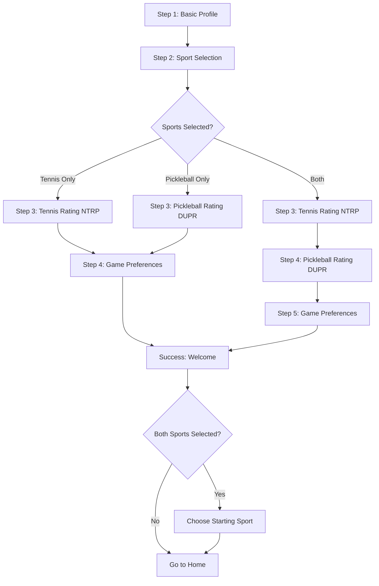

# Onboarding: Profile Creation

## Overview

The onboarding wizard is automatically presented after successful authentication if the user has not yet completed their profile. It collects personal information, sport selection, skill levels, and game preferences through a progressive multi-step flow.

## UX Requirements

> **Critical:** The onboarding process must be as easy, pleasant, and intuitive as possible. Many users abandon apps with complicated onboarding.

**Implementation:**

- Progressive wizard with multiple steps
- Light animations for fluid experience
- Pre-fill data from social login when possible
- Clear progress indication
- Smooth transitions between steps

## Trigger

The onboarding wizard is triggered automatically after authentication if:

- User account exists but onboarding is incomplete
- User just signed up for the first time

## Onboarding Steps

### Step 1: Basic Profile Information

**Fields Collected:**

| Field         | Required | Input Type                  | Notes                              |
| ------------- | -------- | --------------------------- | ---------------------------------- |
| Profile Photo | No       | Camera/gallery upload       | Optional, can be skipped           |
| Full Name     | Yes      | Text input                  | Pre-filled from OAuth if available |
| Birthdate     | Yes      | Date picker                 | Age validation (minimum 13 years)  |
| Gender        | Yes      | Predefined list             | Options: Male, Female, Other       |
| Phone Number  | Yes      | Phone input with validation | Format validation required         |

**Validation:**

- Full name: Required, minimum length TBD
- Birthdate: Must be valid date, user must be at least 13 years old
- Gender: Must select from predefined options
- Phone number: Must be valid format for selected country

### Step 2: Sport Selection

**Question:** "Which sport do you want to play?"

**Options:**

- Tennis
- Pickleball
- Both (can select multiple)

**Behavior:**

- Users can select one or both sports
- Selection determines which sport-specific steps follow
- If both sports selected, Steps 3-4 are shown twice (once per sport)

### Step 3: Sport Rating Selection (Tennis)

**Shown if:** User selected Tennis (only or both)

**Field:** Skill Level (NTRP)

**Input Type:** Rating score card selection

**Options:** NTRP scale cards (1.0 to 7.0)

**Behavior:** Player selects one rating card (e.g., "4.5 NTRP") from displayed cards. Selection is required to proceed.

**Reference:** See [Level Initialization](../04-player-rating/level-initialization.md) and [Level Scales](../04-player-rating/level-scales.md)

### Step 3 (Alternative): Sport Rating Selection (Pickleball)

**Shown if:** User selected Pickleball only

**Field:** Skill Level (DUPR)

**Input Type:** Rating score card selection

**Options:** DUPR scale cards (2.0 to 8.0)

**Behavior:** Player selects one rating card (e.g., "4.0 DUPR") from displayed cards. Selection is required to proceed.

**Reference:** See [Level Initialization](../04-player-rating/level-initialization.md) and [Level Scales](../04-player-rating/level-scales.md)

### Step 4: Sport Rating Selection (Pickleball)

**Shown if:** User selected both sports (after Tennis rating)

**Field:** Skill Level (DUPR)

**Input Type:** Rating score card selection

**Options:** DUPR scale cards (2.0 to 8.0)

**Behavior:** Player selects one rating card (e.g., "4.0 DUPR") from displayed cards. Selection is required to proceed.

### Step 4 (or 5): Game Preferences

**Shown after:** All sport ratings are collected

**Fields Collected:**

| Field                   | Required | Input Type                             | Notes                                       |
| ----------------------- | -------- | -------------------------------------- | ------------------------------------------- |
| Preferred Playing Hand  | Yes      | Predefined: Left, Right, Both          | Single selection for all sports             |
| Max Travel Distance     | Yes      | Slider (distance in km/miles)          | Single value for all sports                 |
| Preferred Game Duration | Yes      | Predefined: 1h, 1.5h, 2h               | Can select same or different for each sport |
| Preferred Match Type    | Yes      | Predefined: Casual, Competitive, Both  | Can select same or different for each sport |
| Player Availabilities   | Yes      | AM/PM/EVE multiselect for each weekday | Weekly schedule (7 days × 3 time blocks)    |

**Duration & Match Type Behavior:**

- If user selected both sports: Show separate selectors for Tennis and Pickleball
- If user selected one sport: Show single selector
- Users can choose the same or different preferences per sport

**Availability Schedule:**

- Grid layout: 7 days (Monday-Sunday) × 3 time blocks (AM, PM, EVE)
- Users can select multiple time blocks per day
- Visual indication of selected availability

## Success Step: Welcome & Sport Selection

After completing all onboarding steps:

1. **Welcome Message**: Display welcome message congratulating the player on joining Rallia

2. **Sport Selection (if both selected)**:
   - If user selected both sports during onboarding, prompt them to choose which sport to start browsing
   - Options: "Start with Tennis" or "Start with Pickleball"
   - This determines the initial sport mode when entering the app

3. **Navigation**: After welcome/sport selection, navigate to the home screen in the selected sport mode

## Screen Flow

## Data Pre-filling

When available from OAuth providers:

- Full Name: Pre-filled from provider
- Email: Pre-filled from provider (not shown in onboarding but stored)
- Profile Photo: Can be imported from provider if available

## Validation Rules

- **Full Name**: Required, minimum length TBD
- **Birthdate**: Must be valid date, user must be at least 13 years old
- **Gender**: Must select from predefined options
- **Phone Number**: Must be valid format, SMS verification may be required
- **Sport Selection**: At least one sport must be selected
- **Skill Level**: Required for each selected sport
- **All Preference Fields**: Required before proceeding

## Progress Indication

- Show step indicator (e.g., "Step 2 of 4" or "Step 3 of 5" if both sports)
- Visual progress bar or step dots
- Allow navigation back to previous steps to make changes

## Error Handling

- Validate each step before allowing progression
- Show clear error messages for invalid inputs
- Highlight required fields that are missing
- Allow correction of errors without losing progress
