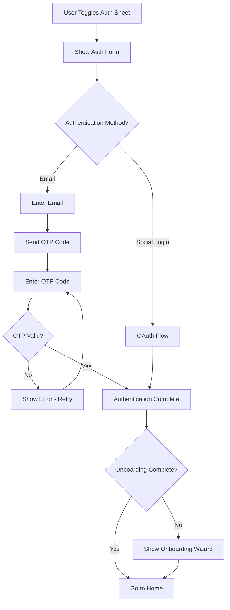

# Sign-In / Log-In

## Overview

Authentication is presented via a bottom sheet modal that appears when users need to sign in or sign up. The modal supports both social login providers and email-based authentication with OTP verification.

## UI Presentation

- **Bottom Sheet Modal**: Authentication interface is presented as a bottom sheet that can be toggled/dismissed
- **First View**: When the auth sheet is opened, users immediately see the authentication form with all available options

## Supported Authentication Methods

| Provider    | Required | Notes                               |
| ----------- | -------- | ----------------------------------- |
| Apple ID    | Yes      | OAuth flow                          |
| Google      | Yes      | OAuth flow                          |
| Facebook    | Yes      | OAuth flow                          |
| Email + OTP | Yes      | Email input → OTP code verification |

## User Flow

## Email OTP Flow

### Step 1: Email Submission

- User enters email address
- Email format validation occurs
- OTP code is sent to the provided email address

### Step 2: OTP Verification

- User receives OTP code via email
- User enters OTP code in the input field
- Code is validated against the server
- On success, authentication is complete
- On failure, user can request a new code or retry

### OTP Requirements

- OTP codes expire after a set time period (TBD)
- Users can request a new code if needed
- Rate limiting should prevent abuse

## Data Collected from Providers

The following information is automatically retrieved from OAuth providers:

| Field         | Source   | Required      |
| ------------- | -------- | ------------- |
| Full Name     | Provider | Yes           |
| Email         | Provider | Yes           |
| Profile Photo | Provider | No (optional) |

For email-based sign-up, only email is collected initially. Additional profile information is collected during onboarding.

## Post-Authentication Flow

After successful authentication:

1. **Check onboarding status**: Determine if user has completed onboarding
2. **If onboarding incomplete**: Automatically present the onboarding wizard
3. **If onboarding complete**: Navigate to home screen

## Security Requirements

- Use secure token storage (Keychain on iOS, Keystore on Android)
- Implement token refresh flows
- Support biometric authentication for returning users
- OTP codes must be cryptographically secure
- Rate limiting on OTP requests
- Session timeout policies TBD

## Error Handling

- Handle provider unavailability gracefully
- Show clear error messages for failed authentication
- Provide retry options for OTP
- Handle invalid/expired OTP codes with clear messaging
- Network error handling for OTP delivery

## Logout

- Clear local tokens and session data
- Optionally offer "Stay logged in on this device" preference
- Dismiss auth sheet and return to unauthenticated state
