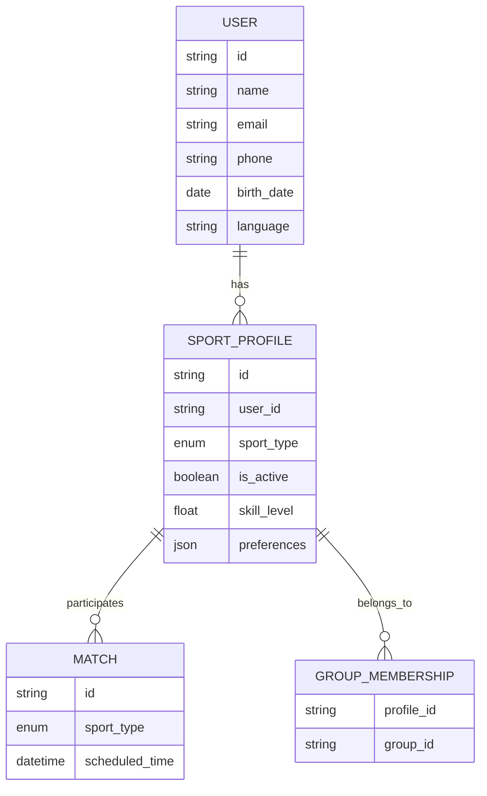

# Data Separation

## Overview

Data architecture supporting complete separation between sport universes while maintaining a single user account.

## Data Model Concept



## Sport-Specific Data

### Per-Sport Profile Data

| Data             | Separation                        |
| ---------------- | --------------------------------- |
| Skill Level      | Separate per sport (NTRP vs DUPR) |
| Matches          | Completely separate               |
| Groups           | Completely separate               |
| Communities      | Completely separate               |
| Favorite Players | Separate per sport                |
| Favorite Courts  | Separate per sport                |
| Playing Style    | Separate per sport                |
| Availability     | Shared (same time slots)          |

### Shared Data

| Data                     | Sharing                    |
| ------------------------ | -------------------------- |
| User Account             | Single account             |
| Reputation               | Single reputation score    |
| Blocked Users            | Blocks apply to all sports |
| Notification Preferences | Shared settings            |
| Payment Methods          | Shared                     |

## Query Patterns

### Fetching Sport-Specific Data

All queries for sport-specific data must include sport context:

```
GET /api/matches?sport=tennis
GET /api/players?sport=pickleball
GET /api/groups?sport=tennis
```

### Fetching Shared Data

```
GET /api/user/profile
GET /api/user/reputation
GET /api/user/blocked
```

## Dormant Profile State

When a sport profile is dormant:

- Profile exists but `is_active = false`
- No matches, groups, or sport-specific data
- Can be activated at any time
- Activation triggers sport-specific onboarding

## Migration Considerations

If adding new sports in the future:

- Create new sport_type enum value
- Generate dormant profiles for existing users
- Allow activation through settings
