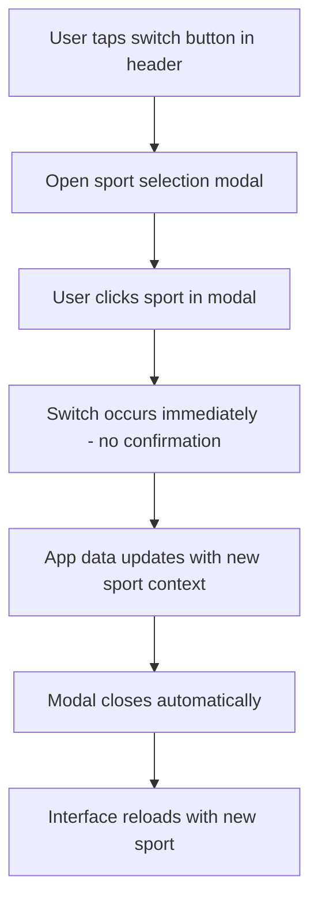
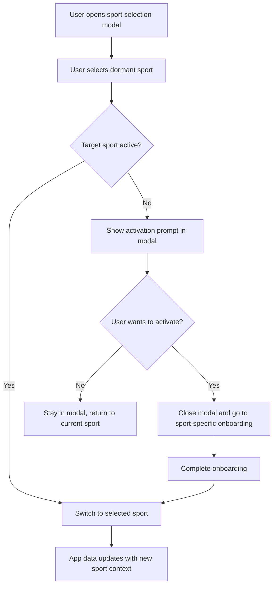

# Interface Switching

## Overview

Users with both sports active can switch between Tennis and Pickleball universes.

## Switch Mechanism

### Switch Button

- Button located in the app header
- Shows current sport mode clearly
- Tapping the button opens a modal for sport selection

### Sport Selection Modal

- Modal displays available sports (Tennis, Pickleball)
- Current sport is highlighted/indicated
- Clicking a sport in the modal switches directly - no confirmation required
- App data updates immediately when selection changes
- Modal closes automatically after selection

### Selection Flow

## Behavior

### What Changes on Switch

| Element            | Behavior                                    |
| ------------------ | ------------------------------------------- |
| Player Directory   | Shows players of the new sport              |
| Matches            | Shows matches of the new sport              |
| Groups/Communities | Shows groups of the new sport               |
| Ratings            | Shows rating for the new sport              |
| Reputation         | Shared across sports (same player behavior) |
| Navigation         | Updates to reflect sport context            |
| Theme/Colors       | Updates to sport-specific palette           |

### What Persists

| Element       | Behavior                              |
| ------------- | ------------------------------------- |
| User account  | Same account, different sport profile |
| Settings      | Most settings are shared              |
| Blocked users | Blocks apply across sports            |

## Dormant Sport Activation

If a user selects a dormant sport from the modal:

## UX Guidelines

- Make current sport always visible (header, tab bar, etc.)
- Use animation for smooth transition
- Preserve navigation state when possible
