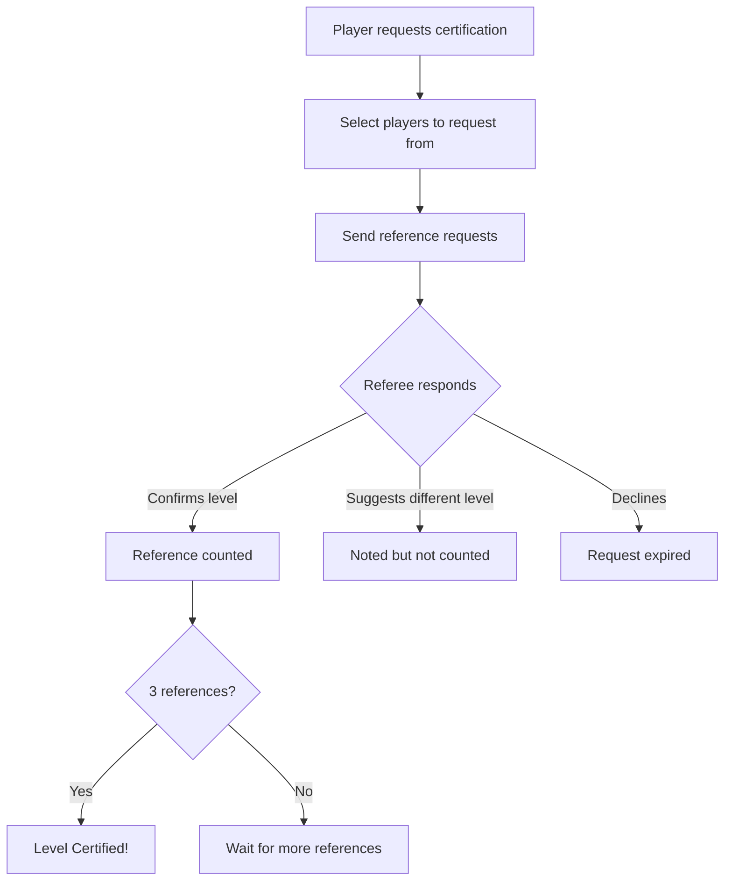
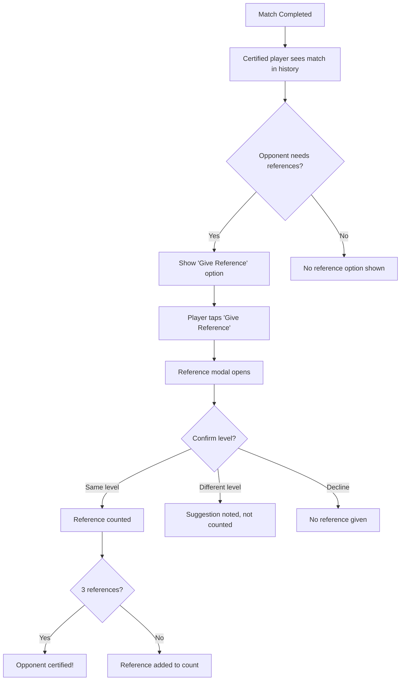

# Level Certification

## Overview

Players can certify their level through peer references or proof submission, earning a certification badge.

## Certification Methods

### Method 1: Peer References

Players can request references from other certified players.

#### Requirements

| Sport      | Threshold | References Needed                           |
| ---------- | --------- | ------------------------------------------- |
| Tennis     | NTRP 3.0+ | 3 certified players at same level or higher |
| Pickleball | DUPR 3.5+ | 3 certified players at same level or higher |

#### Reference Flow

#### Who Can Give References

- Must have certification badge
- Must be at same level or higher than requesting player
- Must be on the app

### Method 2: Proof Submission

Players can submit external proof of their level.

#### Accepted Proof Types

| Proof Type      | Description                                                                                |
| --------------- | ------------------------------------------------------------------------------------------ |
| External Link   | YouTube link, UTR profile, official DUPR link, federation profile, tournament results page |
| Video Recording | Direct video upload of match play                                                          |
| Image           | Screenshots of ratings, tournament results, certificates                                   |
| Document        | PDF or other document files with proof of level                                            |

#### File Upload Requirements

- **Video Recordings:**
  - Players can upload videos directly in the app or provide external links
  - File size limits apply to direct uploads (to be determined)
  - Videos are automatically compressed when possible to limit storage costs
  - Compression maintains video quality sufficient for level evaluation

- **Images and Documents:**
  - File size limits apply (to be determined)
  - Compression applied when possible to limit storage costs

#### Proof Review

- Initially: Manual review by admin team
- Future: AI-assisted video analysis

## Post-Match Reference

After completing a match, certified players can optionally provide a reference for their opponent's level.

### Eligibility to Give Reference

- Referee must have certification badge
- Referee must be at same level or higher than the player being referenced
- Reference can only be given after match completion (after match feedback is submitted)

### Reference Flow

### Reference Options

When giving a post-match reference, the referee can:

- **Confirm level:** Player's declared level matches their observed skill
- **Suggest different level:** Player's skill differs from declared level
  - Can suggest 0.5 higher or lower
  - If 1.0+ different, suggestion is noted but not counted toward certification
- **Decline:** Choose not to provide a reference

### When References Are Available

- Available immediately after match feedback is submitted
- Available until match is closed (48 hours after match end)
- Only shown to certified players who meet eligibility requirements
- Only shown if the opponent has not yet reached 3 references for their current level

### Reference vs. Requested Reference

**Post-Match Reference:**

- Given voluntarily after playing together
- Based on actual match experience
- Can be given without explicit request
- Counts toward certification if level is confirmed

**Requested Reference:**

- Player actively requests references from specific certified players
- Can be requested at any time (not just after matches)
- Requires explicit request and response flow
- Counts toward certification if level is confirmed

Both types of references count toward the 3 references needed for certification.

## Certification Badge

Once certified, players receive a visible badge:

| Element        | Display                 |
| -------------- | ----------------------- |
| Profile        | Checkmark next to level |
| Search Results | Badge indicator         |
| Match Cards    | Certified indicator     |

## Losing Certification

Certification is lost if:

- Player requests level increase → Must re-certify at new level
- Player is downgraded by system → Keeps certification at new level

Certification is kept if:

- Player requests level decrease
- System upgrades or downgrades level based on references
