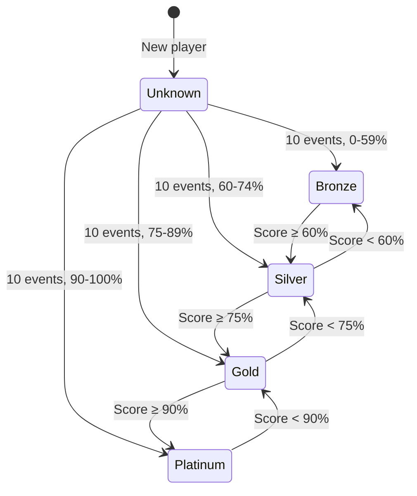

# Reputation Badges

## Tier System

Unlike the original MVP which only had a single "High Reputation" badge at 90%+, the implemented system uses a **5-tier badge system** providing clear progression and motivation at all skill levels.

## The Five Tiers

### Unknown Tier

**Criteria:**

- Player has recorded fewer than 10 reputation events
- Reputation score not yet calculated

**Badge Display:**
| Location | Display |
|----------|---------|
| Player Profile | Gray "?" icon + "New Player" label |
| Search Results | "New Player" indicator |
| Match Cards | "New Player" badge |

**Purpose:**

- Protects new players from unfair judgment
- Prevents reputation gaming with just 1-2 matches
- Fair start for everyone

**Display Example:**

```
Reputation: New Player
Record 10 reputation events to establish your reputation
```

---

### Bronze Tier

**Criteria:**

- 10+ reputation events recorded
- Reputation score: **0-59%**

**Badge Display:**
| Location | Display |
|----------|---------|
| Player Profile | Bronze shield 🥉 + "XX% • Bronze" |
| Search Results | Bronze shield next to name |
| Match Cards | Bronze badge visible |

**Meaning:**

- Below average reliability
- Needs improvement
- Recent or repeated issues

**Display Example:**

```
Reputation: 45% 🥉
[====      ] 45/100
Bronze • Work on reliability to improve
```

**Messaging:**

- Supportive, not punitive
- Clear path to improvement shown
- Encouragement to rebuild trust

---

### Silver Tier

**Criteria:**

- 10+ reputation events recorded
- Reputation score: **60-74%**

**Badge Display:**
| Location | Display |
|----------|---------|
| Player Profile | Silver shield 🥈 + "XX% • Silver" |
| Search Results | Silver shield next to name |
| Match Cards | Silver badge visible |

**Meaning:**

- Average reliability
- Acceptable but room to improve
- Occasional minor issues

**Display Example:**

```
Reputation: 68% 🥈
[=======>  ] 68/100
Silver • Good progress!
```

**Messaging:**

- Positive reinforcement
- Encourage climb to Gold
- Acknowledge good behavior

---

### Gold Tier

**Criteria:**

- 10+ reputation events recorded
- Reputation score: **75-89%**

**Badge Display:**
| Location | Display |
|----------|---------|
| Player Profile | Gold shield 🥇 + "XX% • Gold" |
| Search Results | Gold shield next to name |
| Match Cards | Gold badge visible |

**Meaning:**

- Good reliability
- Trustworthy player
- Consistently positive behavior

**Display Example:**

```
Reputation: 82% 🥇
[========> ] 82/100
Gold • Very reliable player
```

**Messaging:**

- Strong positive reinforcement
- Highlight proximity to Platinum
- Motivate final push to excellence

---

### Platinum Tier ⭐

**Criteria:**

- 10+ reputation events recorded
- Reputation score: **90-100%**

**Badge Display:**
| Location | Display |
|----------|---------|
| Player Profile | Platinum star ⭐ + "XX% • Platinum" |
| Search Results | Platinum star (highlighted) |
| Match Cards | Platinum badge (prominent) |

**Meaning:**

- Excellent reliability
- Highly trustworthy
- Consistently outstanding behavior
- **Elite status**

**Display Example:**

```
Reputation: 94% ⭐
[==========>] 94/100
Platinum • Excellent reliability!
```

**Special Benefits:**

- Eligible for "Most Wanted Player" super-badge (requires Platinum + Certified Level)
- Featured in daily digest emails
- Higher match acceptance rates
- Community recognition

---

## Tier Transitions

### State Diagram



### Earning Tiers

Tiers are awarded **automatically and immediately** when:

1. Player has 10+ reputation events recorded (if moving from Unknown)
2. Reputation score crosses tier threshold
3. Reputation is recalculated after any event

**No manual approval required.**

### Losing Tiers

Tiers are removed **automatically and immediately** when:

- Reputation drops below tier threshold
- Happens after negative events (no-show, late cancellation, etc.)

**Players are notified when tier changes.**

---

## Badge Interaction with Gamification

### Most Wanted Player Super-Badge

The **Platinum reputation tier** is a prerequisite for the elite "Most Wanted Player" super-badge.

| Badge                  | Requirements                                  |
| ---------------------- | --------------------------------------------- |
| Platinum Reputation    | Reputation ≥ 90%                              |
| Certified Level        | Level certified through 3+ referrals or proof |
| **Most Wanted Player** | Platinum Reputation **AND** Certified Level   |

**Special Features:**

- Featured in daily digest email to all players
- "Most Wanted Player" identifier on profile
- Badge has special visual treatment
- Major growth hack: encourages good behavior + level certification

**See:** [Gamification System](../13-gamification/README.md) for full badge system

---

## Notifications

### Tier Upgrade Notifications

**Bronze → Silver:**

```
🎉 Reputation Upgrade!
You've reached Silver tier (XX%)!

Your improved behavior is recognized. Keep it up!

[View Profile]
```

**Silver → Gold:**

```
🎉 Great Progress!
You've reached Gold tier (XX%)!

You're a reliable player. Just 15% more to Platinum!

[View Profile]
```

**Gold → Platinum:**

```
🌟 Excellent Achievement!
You've reached Platinum tier (XX%)!

You're now among the most reliable players on Rallia!

🏆 You're eligible for the "Most Wanted Player" super-badge!
Get your rating certified to unlock it.

[View Profile] [Learn More]
```

**Unknown → Any Tier:**

```
🎯 Reputation Established!
You've recorded 10 reputation events and earned [Tier] tier (XX%)!

Your reputation is now visible to other players.

[View Profile]
```

### Tier Downgrade Notifications

**Platinum → Gold:**

```
⚠️ Reputation Update
Your tier has changed from Platinum to Gold (XX%)

Recent events affected your reputation. Here's how to get back to Platinum:
• Show up to all matches
• Arrive on time
• Be a great sport

You're only [X]% away from Platinum again!

[View Tips] [Dismiss]
```

**Gold → Silver:**

```
⚠️ Reputation Update
Your tier has changed from Gold to Silver (XX%)

Let's rebuild your reputation together:
• Focus on reliability
• Communicate proactively
• Be punctual

[View Tips] [Dismiss]
```

**Silver → Bronze:**

```
⚠️ Important: Reputation Alert
Your tier has changed from Silver to Bronze (XX%)

Your reputation needs attention. Please review our community guidelines:
• Always show up to accepted matches
• Cancel with 24+ hours notice if needed
• Arrive on time
• Be respectful

Good news: You can recover quickly with consistent good behavior!

[View Recovery Tips] [Community Guidelines]
```

### Approaching Milestone Notifications

**Close to next tier (within 5%):**

```
🎯 Almost There!
You're at XX% - just [X]% away from [Next Tier]!

Next good match could push you over!

[View Progress]
```

**Example:**

```
🎯 Almost There!
You're at 88% - just 2% away from Platinum!

One perfect match and you'll unlock elite status!
```

---

## Visual Design Guidelines

### Badge Icons

| Tier     | Icon   | Color              | Style                          |
| -------- | ------ | ------------------ | ------------------------------ |
| Unknown  | ?      | Gray (#94A3B8)     | Circle with question mark      |
| Bronze   | Shield | Bronze (#CD7F32)   | Solid shield                   |
| Silver   | Shield | Silver (#C0C0C0)   | Solid shield                   |
| Gold     | Shield | Gold (#FFD700)     | Solid shield with subtle shine |
| Platinum | Star   | Platinum (#E5E4E2) | Star with glow effect          |

### Badge Sizes

| Context        | Size          | Additional Info               |
| -------------- | ------------- | ----------------------------- |
| Profile Header | Large (48px)  | With percentage and tier name |
| Match Card     | Medium (32px) | Icon only or with percentage  |
| Search Results | Small (24px)  | Icon only                     |
| Notification   | Medium (32px) | Icon with tier name           |

### Color Coding

Use tier colors consistently across the app:

- **Unknown:** Gray text and borders
- **Bronze:** Bronze/brown tones
- **Silver:** Silver/light gray tones
- **Gold:** Gold/yellow tones
- **Platinum:** Platinum/white with subtle glow

### Accessibility

- All badges must have text alternatives
- Color is not the only differentiator (use shapes)
- Screen reader text: "[Player name] has [Tier] reputation tier at [XX]%"
- High contrast mode support

---

## Badge Display Contexts

### 1. Player Profile (Own)

```
┌─────────────────────────────┐
│ Your Reputation             │
│                             │
│        94% ⭐               │
│    [==========>] 94/100     │
│                             │
│ Platinum • Excellent!       │
│                             │
│ Matches completed: 24       │
│ Average rating: 4.5 ⭐      │
│ On-time rate: 96%           │
│                             │
│ [View Details]              │
└─────────────────────────────┘
```

### 2. Player Profile (Other Players Viewing)

```
┌─────────────────────────────┐
│ John Smith                  │
│ 82% 🥇 Gold                 │
│                             │
│ [Send Match Request]        │
└─────────────────────────────┘
```

### 3. Match Request Card

```
┌─────────────────────────────┐
│ Match Request from          │
│                             │
│ Sarah Johnson               │
│ 94% ⭐ Platinum             │
│                             │
│ Tennis • Singles            │
│ Tomorrow at 2:00 PM         │
│                             │
│ [Accept] [Decline]          │
└─────────────────────────────┘
```

### 4. Search Results

```
┌─────────────────────────────┐
│ Sarah Johnson    94% ⭐     │
│ Tennis • NTRP 4.0           │
│ Montreal • 2.3 km away      │
├─────────────────────────────┤
│ Mike Chen        78% 🥇     │
│ Tennis • NTRP 3.5           │
│ Montreal • 3.7 km away      │
├─────────────────────────────┤
│ Emma Wilson      65% 🥈     │
│ Tennis • NTRP 4.0           │
│ Montreal • 1.8 km away      │
└─────────────────────────────┘
```

### 5. Unknown Reputation Display

```
┌─────────────────────────────┐
│ Alex Martinez    New Player │
│ Tennis • NTRP 3.5           │
│ Montreal • 4.1 km away      │
│                             │
│ Record 10 reputation events │
│ to establish reputation     │
└─────────────────────────────┘
```

---

## Comparison: Old vs New System

### Original MVP Spec

| Aspect      | Original Design                        |
| ----------- | -------------------------------------- |
| Tiers       | None - just pass/fail at 90%           |
| Badge       | Single "High Reputation" badge at 90%+ |
| Below 90%   | No badge, just percentage              |
| Threshold   | Hard cutoff at 90%                     |
| Progression | Not clear for players under 90%        |

### Implemented System

| Aspect      | New Design                                        |
| ----------- | ------------------------------------------------- |
| Tiers       | 5 tiers (Unknown, Bronze, Silver, Gold, Platinum) |
| Badges      | Distinct badge for each tier                      |
| All Levels  | Everyone has a tier (after 10 events)             |
| Thresholds  | Progressive: 60%, 75%, 90%                        |
| Progression | Clear path: Bronze → Silver → Gold → Platinum     |

### Why the Change?

**Problems with single-badge approach:**

- No recognition for players between 0-89%
- Demotivating for most players
- Unclear progression path
- Binary good/bad perception

**Benefits of tier system:**

- Clear progression for all players
- Motivation at every level
- Reduces stigma of low scores
- Gamification and engagement
- Matches modern app patterns (Bronze/Silver/Gold/Platinum common in games)

---

## Most Wanted Player Integration

### Requirements

To earn the **Most Wanted Player** super-badge, players must have:

1. **Platinum Reputation (90%+)** ← This document
2. **Certified Rating Level** ← See [Level Certification](../04-player-rating/level-certification.md)

### Benefits

Players with **Most Wanted Player** super-badge:

- Featured in daily digest email
- Special profile badge
- Higher visibility in search
- Community recognition

### Daily Digest Email

```
🌟 New Most Wanted Players Today!

Sarah Johnson - Tennis NTRP 4.0 • Platinum Reputation
Mike Chen - Pickleball DUPR 4.5 • Platinum Reputation
Emma Wilson - Tennis NTRP 3.5 • Platinum Reputation

These players have both excellent reputation and certified
skill levels - the most reliable opponents you can find!

[View All Most Wanted Players]
```

**See:** MVP_SPECS.md Section 18 for full "Most Wanted Player" details

---

## Key Takeaways

1. **Five tiers** instead of single badge - more engaging
2. **Platinum (90%+)** replaces "High Reputation" badge
3. **Progressive system** motivates all players, not just top performers
4. **Clear milestones** at 60%, 75%, and 90%
5. **Unknown tier** protects new players (< 10 events)
6. **Integration** with Most Wanted Player super-badge
7. **Visual hierarchy** with distinct icons and colors
