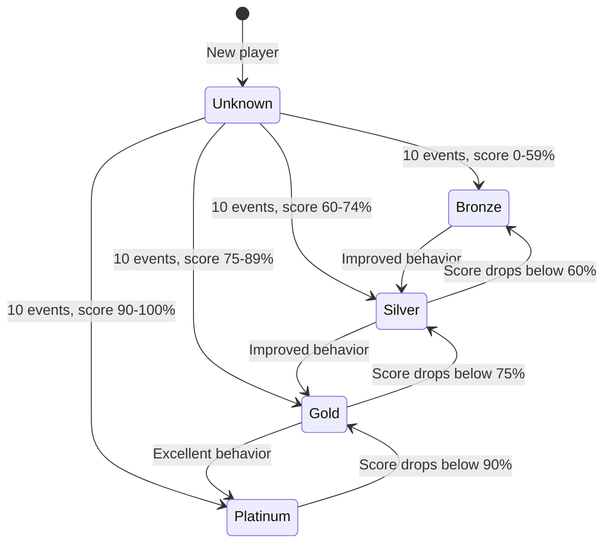

# Reputation Overview

## Definition

> **Reputation** is a score from 0-100% reflecting how reliable and respectful a player is, calculated from all their behavioral events over time.

## Architecture: Event-Driven System

Unlike a simple formula, the reputation system uses an **event-driven architecture**:

1. Every reputation-affecting action creates an immutable **reputation event**
2. Events are stored with timestamps, impact values, and context
3. Reputation score is calculated by summing all weighted event impacts
4. Recent events matter more through **time decay** (6-month half-life)

### Why Event-Driven?

| Benefit         | Description                                              |
| --------------- | -------------------------------------------------------- |
| Auditability    | Complete history for admin review and dispute resolution |
| Flexibility     | Easy to add new event types without schema changes       |
| Recalculability | Can rebuild reputation if formula changes                |
| Privacy         | Events stored separately from player-visible data        |
| Fairness        | Time decay lets players recover from past mistakes       |

## What Reputation Measures

| Factor                 | Included | Event Types                                                         |
| ---------------------- | -------- | ------------------------------------------------------------------- |
| Match completion       | ✅ Yes   | `match_completed` (+12)                                             |
| Showing up             | ✅ Yes   | `match_no_show` (-50)                                               |
| Punctuality            | ✅ Yes   | `match_on_time` (+3), `match_late` (-10)                            |
| Cancellation timing    | ✅ Yes   | `match_cancelled_early` (0), `match_cancelled_late` (-25)           |
| Opponent satisfaction  | ✅ Yes   | `review_received_5star` (+10) through `review_received_1star` (-10) |
| Repeat play            | ✅ Yes   | `match_repeat_opponent` (+2)                                        |
| Community contribution | ✅ Yes   | `first_match_bonus` (+5)                                            |
| Reports & moderation   | ✅ Yes   | `report_upheld` (-15), `report_dismissed` (+3)                      |
| Skill level difference | ❌ No    | Explicitly excluded                                                 |

> **Important:** Skill level mismatch is explicitly excluded from reputation, even though it can be frustrating. This must be communicated clearly to players.

## Scale and Tiers

### Score Range

- **Range:** 0% to 100%
- **Starting point:** 100% (players start with good reputation)
- **Bounds:** Never exceeds 100% or goes below 0%

### Tier System

| Tier         | Score Range | Badge         | Meaning                                 |
| ------------ | ----------- | ------------- | --------------------------------------- |
| **Unknown**  | N/A         | Gray "?"      | New player, needs 10+ reputation events |
| **Bronze**   | 0-59%       | Bronze shield | Below average reliability               |
| **Silver**   | 60-74%      | Silver shield | Average reliability                     |
| **Gold**     | 75-89%      | Gold shield   | Good reliability                        |
| **Platinum** | 90-100%     | Platinum star | Excellent - consistently reliable       |



## Time Decay

Events gradually lose impact over time, allowing players to improve their reputation:

```
decay_factor(age_days) = 0.5^(age_days / 180)
```

**Examples:**

- **Today**: Event has 100% impact
- **3 months old**: Event has ~71% impact
- **6 months old**: Event has 50% impact
- **1 year old**: Event has 25% impact
- **2 years old**: Event has ~6% impact

This means a no-show from 2 years ago barely affects current reputation, while recent good behavior has strong positive impact.

## Visibility & Privacy

### What Players Can See

**On other players' profiles:**
| Information | Visible? |
|-------------|----------|
| Reputation tier badge | ✅ Yes (if 10+ events) |
| Exact score percentage | ✅ Yes (if 10+ events) |
| "New Player" indicator | ✅ Yes (if < 10 events) |

**On their own profile:**
| Information | Visible? |
|-------------|----------|
| Current score and tier | ✅ Yes |
| Matches completed count | ✅ Yes |
| Total positive/negative events | ✅ Yes (aggregated only) |
| Average review rating | ✅ Yes |
| Reputation trend | ✅ Yes (improving/stable/declining) |
| Individual events | ❌ No |
| Event timestamps | ❌ No |
| Who caused events | ❌ No |
| Event details | ❌ No |

### Privacy-First Design

> **Critical:** Individual events are NEVER exposed to players to prevent retaliation.

**Why this matters:**

- Prevents players from identifying and retaliating against those who gave negative reviews
- Reduces social pressure and awkwardness
- Maintains trust in the system
- Similar to Uber/Airbnb: you know ratings matter but can't see who gave what rating

**Admin access only:**

- Full event history with timestamps
- Event context (match_id, caused_by_player_id)
- Used only for dispute resolution

## Initial State

All new players start with **unknown reputation** until 10 reputation events have been recorded.

**Rationale:**

- Prevents unfair judgment from limited data
- Protects genuinely good players who had isolated bad experiences
- Gives new players a fair start with sufficient data points
- Ensures reputation score is statistically meaningful

**After 10 events:**

- Reputation becomes public
- Tier badge appears
- Score is calculated from all events

## Display Examples

### Unknown Reputation (< 10 events)

```
Reputation: New Player
Record 10 reputation events to establish your reputation
```

### Bronze Tier (0-59%)

```
Reputation: 45% 🥉
[====      ] 45/100
Bronze • Work on reliability to improve
```

### Silver Tier (60-74%)

```
Reputation: 68% 🥈
[=======>  ] 68/100
Silver • Good progress!
```

### Gold Tier (75-89%)

```
Reputation: 82% 🥇
[========> ] 82/100
Gold • Very reliable player
```

### Platinum Tier (90-100%)

```
Reputation: 94% ⭐
[==========>] 94/100
Platinum • Excellent reliability!
```

## Impact on Player Experience

### Match Requests

- Reputation tier badge shown on all match requests
- Helps players decide whether to accept
- Platinum players more likely to get matches

### Most Wanted Player Badge

- Requires **Platinum reputation (90%+)**
- Combined with certified rating level
- Featured in daily digest emails
- Major growth hack feature

### Future Features

- Reputation-based filtering in match search
- Priority matching for Platinum players
- Reputation protection (insurance) for good players
