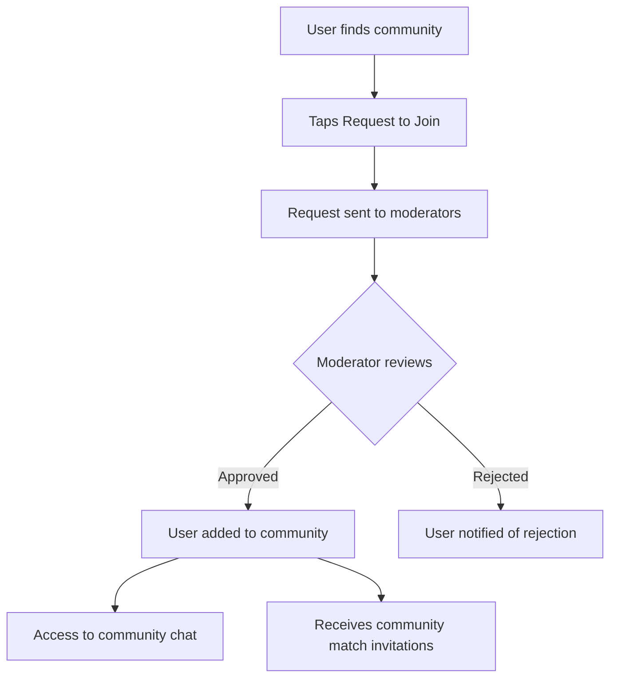

# Communities

## Overview

Larger, semi-public groups of players. Discoverable in the app, with membership requiring approval.

## Examples

- "Tennis Addicts Montreal"
- "Downtown Pickleball Club"
- "Weekend Warriors"

## Community Properties

| Property    | Value                           |
| ----------- | ------------------------------- |
| Max Size    | No practical limit              |
| Visibility  | Public listing, private content |
| Join Method | Request + approval              |
| Chat        | Automatically created           |

## Creating a Community

1. Tap "Create Community"
2. Fill in community profile:
   - Name (required)
   - Description (required)
   - Location/area
   - Photo/logo
   - Sport (Tennis or Pickleball)
   - Skill level range (optional)
3. Community created
4. Creator is moderator by default

## Community Profile (Front Page)

Visible to all users:

```
┌─────────────────────────────────────────┐
│ [Community Photo/Logo]                  │
│                                         │
│ Tennis Addicts Montreal                 │
│ 🎾 Tennis • Montreal, QC                │
│ 234 members                             │
│                                         │
│ "A community for tennis enthusiasts     │
│  looking for regular matches and        │
│  friendly competition."                 │
│                                         │
│ Skill Levels: NTRP 3.0 - 5.0            │
│                                         │
│ [Request to Join]                       │
└─────────────────────────────────────────┘
```

Reference: RacketPal for community front pages.

## Joining a Community



## Roles

### Moderator

- Approve/reject join requests
- Add members directly
- Remove members
- Assign other moderators
- Edit community profile
- Delete the community

### Member

- Access community chat
- Receive match invitations
- View member list
- Leave community
- Cannot add/remove members

## Moderation Rules

Following WhatsApp patterns:

- Moderators can add members without approval
- Added members can leave at any time
- Multiple moderators possible
- Creator cannot be removed (unless they leave)

## Community Chat

Automatically created. All members can participate.

## Using Communities for Matches

When creating a match:

1. Select recipients
2. Choose one or more communities
3. Match visible to all community members
4. Based on match settings:
   - Auto-join: First to accept
   - Manual approval: Creator confirms

## Discoverability

Communities appear in:

- Community directory (searchable)
- Map view (if location set)
- Recommendations based on user profile

## Sport Separation

Communities are sport-specific:

- Tennis communities
- Pickleball communities
