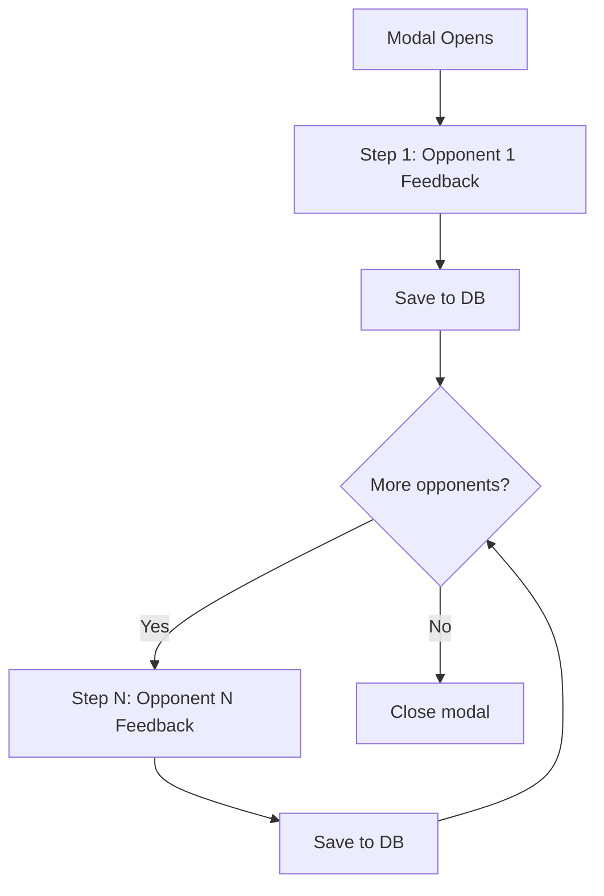
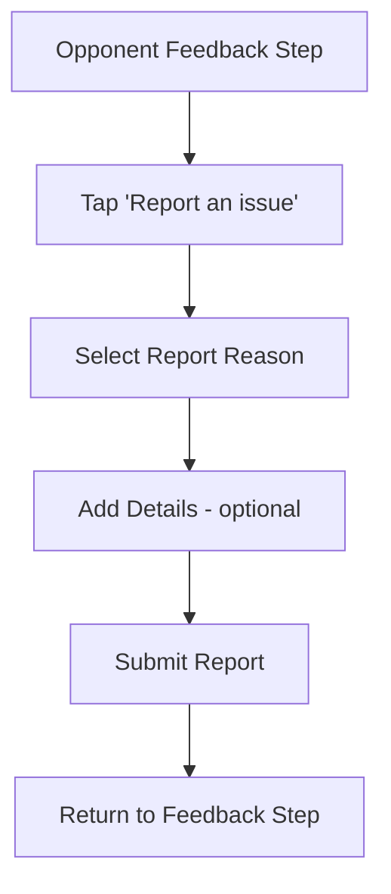
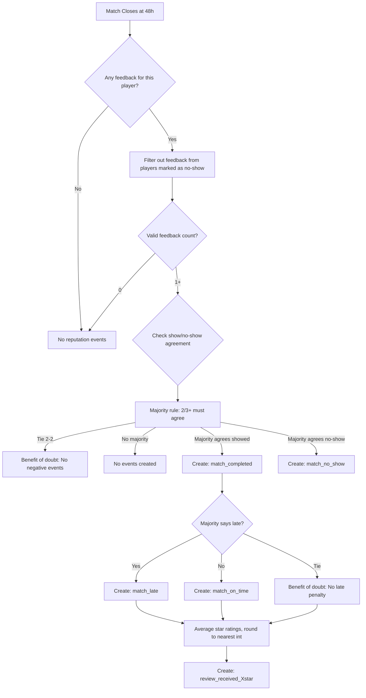

# Match Closure

## Overview

How matches are closed and feedback is collected from all participants.

## Expiration

### Unaccepted Matches

Matches that were never accepted expire at the scheduled start time.

- Status changes to "Expired"
- No notifications sent
- Match removed from active views

### Accepted Matches

Accepted matches proceed to feedback collection.

## Feedback Collection

### Availability

The feedback form becomes available **immediately after the match ends**.

The feedback button in the match detail sheet remains available until:

- The match is closed (48 hours after match end), OR
- `feedback_completed = true` on the participant record (has submitted feedback for each opponent)

(Whichever comes first)

### Trigger

1 hour after scheduled match end time:

- All participants receive feedback request
- Via: Push notification + Email

### Entry Points

The feedback modal can be opened from:

- **Match Detail Sheet:** User manually opens feedback from the match detail sheet (available immediately after match ends, until feedback is completed for all opponents or match closes)
- **Notification/Email:** User clicks the notification or email link (sent 1 hour after match ends)
- **App Launch:** User opens the app for the first time since the match ended (automatic, if match ended more than 1 hour ago)

If multiple matches are pending feedback, show them one at a time, **most recent match first**.

## Feedback Wizard Modal

The feedback form is presented as a multi-step wizard in a modal (bottom sheet or overlay).

### Flow Diagram



### Opponent Feedback Steps

One step per opponent. In doubles, up to 3 steps (one for each of the other players).

| Element                    | Details                                                                   |
| -------------------------- | ------------------------------------------------------------------------- |
| Header                     | Opponent's avatar + full name                                             |
| Field 1: Attendance        | Toggle: "Did they show up?" (Yes default)                                 |
| Info text                  | "If someone other than the registered player showed up, select 'No-show'" |
| Field 2: Late              | Toggle: "Were they late (10+ min)?" (hidden if no-show)                   |
| Field 3: Star rating       | 1-5 stars: "Rate your experience" (hidden if no-show)                     |
| Field 4: Comments          | Text field: "Any comments?" (optional)                                    |
| Report link                | "Report an issue" → opens report flow (see below)                         |
| Button (if more opponents) | "Continue" → **save feedback**, proceed to next opponent                  |
| Button (if last opponent)  | "Complete" → **save feedback**, close modal                               |

### Feedback Persistence

Each opponent's feedback is committed to the database immediately when the user presses:

- **Continue** → saves current opponent's feedback, moves to next
- **Complete** → saves current opponent's feedback, closes modal

**Reputation Incentive:**

- When each feedback record is saved, a `feedback_submitted` reputation event (+1) is created immediately
- This rewards players for contributing to the feedback system
- In doubles, a player can earn up to +3 reputation (3 feedbacks × +1 each)

This means:

- Partial feedback is valid (e.g., rating 2/3 opponents in doubles, then abandoning)
- Each feedback record is saved independently
- The feedback button remains available until all opponents are rated or match closes

### Resuming Partial Feedback

If a user reopens the feedback modal after rating some opponents:

- Modal shows only opponents who haven't been rated yet
- Already-submitted feedback is not editable
- When the last opponent is rated, `feedback_completed` is set to `true` on the participant record
- If `feedback_completed = true`, the feedback button is hidden

### Conditional Fields

**If No-show is selected:**

- Hide Late and Star rating fields
- Show Cancellation Reason field (optional)
- Only Attendance toggle, Cancellation Reason, and Comments remain visible

**Cancellation Reason Field:**

When a player marks an opponent as "No-show", an optional cancellation reason dropdown appears:

| Reason            | Description                               |
| ----------------- | ----------------------------------------- |
| Weather           | Match cancelled due to weather conditions |
| Court unavailable | Court was not available as expected       |
| Emergency         | Personal emergency prevented the match    |
| Other             | Other reason (free text input appears)    |

This field is used during mutual cancellation detection to record why the match didn't happen.

**Note:** If a substitute showed up (someone other than the registered player), select "No-show" as it has the same reputation impact.

## Reporting Issues

### Report Link

Each opponent feedback step includes a "Report an issue" link at the bottom of the form. Tapping it opens a report sub-flow without losing the current feedback state.

### Report Flow



### Report Reasons

| Reason                | Description                                             | Priority |
| --------------------- | ------------------------------------------------------- | -------- |
| Harassment            | Verbal abuse, intimidation, or threatening behavior     | High     |
| Unsportsmanlike       | Cheating, intentional bad calls, aggressive play        | Medium   |
| Safety concern        | Dangerous behavior, physical altercation                | High     |
| Misrepresented level  | Player's skill was significantly different than claimed | Low      |
| Inappropriate conduct | Other inappropriate behavior not covered above          | Medium   |

### Report Submission

When a report is submitted:

1. Report is saved to the `match_report` table (see below)
2. Report is added to the moderation queue (see [Content Moderation](../15-admin/content-moderation.md))
3. High priority reports trigger immediate admin notification
4. User can continue with feedback submission
5. A `report_received` event (0 impact) is created on the reported player

### Report Does Not Replace Feedback

- Reporting is separate from feedback submission
- Users should still complete the feedback form (attendance, rating, etc.)
- The report provides additional context for moderation review
- Reports can be submitted even if the player showed up and the match was good overall

## Database Model

### `match_feedback` Table

One record per reviewer-opponent pair.

| Column              | Type      | Description                                                   |
| ------------------- | --------- | ------------------------------------------------------------- |
| id                  | uuid      | Primary key                                                   |
| match_id            | uuid      | FK to match                                                   |
| reviewer_id         | uuid      | FK to player (who gave feedback)                              |
| opponent_id         | uuid      | FK to player (who received feedback)                          |
| showed_up           | boolean   | Did opponent show up (false = no-show)                        |
| was_late            | boolean   | Was opponent 10+ min late (nullable)                          |
| star_rating         | int (1-5) | Experience rating (nullable)                                  |
| cancellation_reason | enum      | Why match didn't happen (nullable, only if showed_up = false) |
| cancellation_notes  | text      | Free text if cancellation_reason = "other" (nullable)         |
| comments            | text      | Optional comments (nullable)                                  |
| created_at          | timestamp | When submitted                                                |

### `match_report` Table

One record per report submitted during match feedback.

| Column      | Type      | Description                                                              |
| ----------- | --------- | ------------------------------------------------------------------------ |
| id          | uuid      | Primary key                                                              |
| match_id    | uuid      | FK to match                                                              |
| reporter_id | uuid      | FK to player (who submitted report)                                      |
| reported_id | uuid      | FK to player (who is being reported)                                     |
| reason      | enum      | harassment, unsportsmanlike, safety, misrepresented_level, inappropriate |
| details     | text      | Additional details (optional)                                            |
| priority    | enum      | high, medium, low (derived from reason)                                  |
| status      | enum      | pending, reviewed, dismissed, action_taken                               |
| created_at  | timestamp | When submitted                                                           |

### Record Count Examples

| Match Type | Players | Max Feedback Records | Max Report Records |
| ---------- | ------- | -------------------- | ------------------ |
| Singles    | 2       | 2 (each rates other) | 2                  |
| Doubles    | 4       | 12 (each rates 3)    | 12                 |

### Match-Level Closure Fields

Added to the **match record** at closure:

| Field               | Type      | Description                                                                   |
| ------------------- | --------- | ----------------------------------------------------------------------------- |
| closed_at           | timestamp | When match was closed (48h after end)                                         |
| mutually_cancelled  | boolean   | True if all players marked all opponents as no-show                           |
| cancellation_reason | enum      | Reason for mutual cancellation (weather, court_unavailable, emergency, other) |
| cancellation_notes  | text      | Free text notes if reason is "other" (nullable)                               |

## Automatic Closure

48 hours after match end time:

1. Match automatically flagged as closed
2. System checks for mutual cancellation (all players marked all opponents as no-show)
3. If mutual cancellation: match flagged as `mutually_cancelled`, cancellation reason aggregated, no reputation events
4. If not: feedback records are analyzed and aggregated per participant
5. Aggregated feedback is recorded on each match participant record
6. Reputation events are created based on aggregated feedback

## Reputation Event Creation

**Immediate Events:**

- `feedback_submitted` (+1) is created immediately when each feedback record is saved

**Closure Events:**

- All other reputation events are created at the 48-hour closure mark based on aggregated feedback

### Mutual Cancellation Detection

Before processing individual feedback, the system checks for mutual cancellation:

**Singles:** If both players mark each other as no-show → mutual cancellation detected
**Doubles:** If all players mark all opponents as no-show → mutual cancellation detected

When mutual cancellation is detected:

- No `match_no_show` events are created for anyone
- No `match_completed` events are created
- Match is flagged as "mutually cancelled"
- No reputation impact for any participant
- Cancellation reason is aggregated from feedback (most common reason selected)

**Reason Aggregation:**

If multiple players provided cancellation reasons:

- Use the most frequently selected reason
- If tie, use priority order: weather > court_unavailable > emergency > other
- Store any "other" free text in `cancellation_notes`

### No-Show Handling

When a player is marked as no-show:

- The registered player receives `match_no_show` penalty (-50 reputation)
- If a substitute showed up (someone other than the registered player), this should also be marked as no-show
- The match may be flagged for potential review if a substitute was sent without prior notice

**Note:** Sending a substitute without prior notice is treated the same as a no-show because:

- Other players expected to play with a specific person (skill level, familiarity)
- It wastes time if the substitute is unacceptable to other players
- It circumvents the trust system (substitute has no reputation on record)

### Singles Logic

If the opponent submitted feedback:

| Feedback Scenario       | Result                                              |
| ----------------------- | --------------------------------------------------- |
| Not submitted           | No reputation events for this player                |
| Mutual cancellation     | No reputation events (see above)                    |
| Opponent marked showed  | Create `match_completed`, late/on-time, star rating |
| Opponent marked no-show | Create `match_no_show`                              |

### Doubles Logic

For each player receiving feedback, apply the following heuristic:



### Aggregation Rules for Doubles

| Field          | Aggregation Method                                                       |
| -------------- | ------------------------------------------------------------------------ |
| Show/No-show   | Majority rule (2/3+ agreement required). **Tie (2-2): benefit of doubt** |
| Late           | Majority rule (2/3+ agreement required). **Tie (2-2): benefit of doubt** |
| Star rating    | Average, rounded to nearest integer                                      |
| No-show source | Feedback from no-show players is **ignored**                             |

**Benefit of Doubt Rule:**

- If a tie occurs (e.g., 2-2 in doubles), no negative impact results
- For show/no-show: If tied, no `match_no_show` event is created
- For late: If tied, no `match_late` event is created (but `match_on_time` may still be created if majority says on-time)

### Match Participant Feedback Fields

Fields added to the **match participant record** for tracking feedback:

| Field              | Type      | Description                                          | When Updated             |
| ------------------ | --------- | ---------------------------------------------------- | ------------------------ |
| feedback_completed | boolean   | Has this player submitted feedback for all opponents | When last opponent rated |
| showed_up          | boolean   | Final show/no-show determination (nullable)          | At 48h closure           |
| was_late           | boolean   | Final late determination (nullable)                  | At 48h closure           |
| star_rating        | int (1-5) | Averaged star rating, rounded (nullable)             | At 48h closure           |
| aggregated_at      | timestamp | When aggregation was computed                        | At 48h closure           |

**Notes:**

- `feedback_completed` is updated immediately when the player rates their last opponent
- `feedback_completed` is used to hide the feedback button in the match detail sheet
- Fields (`showed_up`, `was_late`, `star_rating`) are `nullable` - if no valid feedback was received, these remain null
- For singles: values come directly from opponent's feedback
- For doubles: values come from majority rule and averaging (see aggregation rules above)
- **Ties in majority rule:** If a tie occurs (e.g., 2-2), benefit of doubt applies - no negative values are set
- **Substitute handling:** If a substitute showed up, it should be marked as no-show (same reputation impact)
- These values are used to create reputation events

### Reputation Events Reference

| Condition          | Event                   | Impact | When Created                    |
| ------------------ | ----------------------- | ------ | ------------------------------- |
| Feedback submitted | `feedback_submitted`    | +1     | Immediately when feedback saved |
| Showed up          | `match_completed`       | +12    | At 48h closure                  |
| No-show            | `match_no_show`         | -50    | At 48h closure                  |
| On time            | `match_on_time`         | +3     | At 48h closure                  |
| Late (10+ min)     | `match_late`            | -10    | At 48h closure                  |
| 5-star rating      | `review_received_5star` | +10    | At 48h closure                  |
| 4-star rating      | `review_received_4star` | +5     | At 48h closure                  |
| 3-star rating      | `review_received_3star` | 0      | At 48h closure                  |
| 2-star rating      | `review_received_2star` | -5     | At 48h closure                  |
| 1-star rating      | `review_received_1star` | -10    | At 48h closure                  |

**Note:** `feedback_submitted` events are created immediately when feedback is saved, while all other events are created at the 48-hour closure mark.

See [Reputation Calculation](../05-reputation/reputation-calculation.md) for full details.

## Post-Match UI

### Match Summary

After closure, show match in history:

```
┌─────────────────────────────────────────┐
│ Match with Jean D. - Completed          │
│ January 10, 2026 • 3pm                  │
│                                         │
│ Your feedback: ⭐⭐⭐⭐⭐ (5/5)            │
│ Their feedback: ⭐⭐⭐⭐ (4/5)             │
│                                         │
│ [View Details]                          │
└─────────────────────────────────────────┘
```

## Suggestions

### Gamification

- "Congratulations, you received 5 stars!"
- Animations/rewards for consistent good feedback
- Track streaks of positive matches

### Match Summary Enhancements

Future enhancement:

- Allow adding score
- Weather at time of match
- Photos from match
- Share to social media
