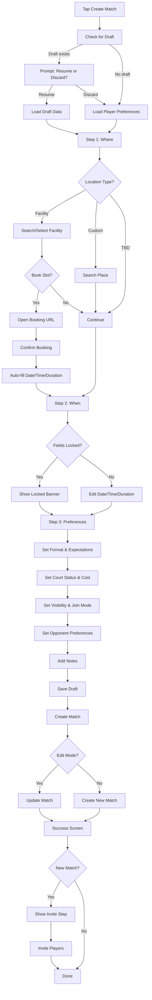

# Match Creation

## UX Priority

> **Critical:** Match creation must be completed VERY QUICKLY (seconds ideally). Speed impacts user retention significantly.

**Strategies:**

- Pre-fill from user preferences
- Smart defaults
- Minimal required fields
- Draft persistence (auto-save progress)
- One-tap templates (future)

## Wizard Structure

Match creation uses a **3-step wizard** with horizontal slide animations, progress indicator, and swipe gestures:

1. **Step 1: Where** - Location selection
2. **Step 2: When** - Date, time, duration, timezone
3. **Step 3: Preferences** - Format, expectations, court status, cost, visibility, join mode, opponent preferences, notes

## Step 1: Where

### Location Type

| Type         | Description                        | Required Fields |
| ------------ | ---------------------------------- | --------------- |
| **Facility** | Select from registered facilities  | `facilityId`    |
| **Custom**   | Enter custom location name/address | `locationName`  |
| **TBD**      | Location to be determined later    | None            |

### Facility Selection

- Search facilities by name
- Shows distance from user's location
- Displays preferred facility badge (if user has one set)
- Shows available court slots (if facility has booking integration)
- User can book a slot directly, which auto-fills date/time/duration in Step 2

### Custom Location

- Google Places autocomplete search
- Manual address entry/edit
- Optional coordinates (auto-fetched from place details)

### Field Details

| Field            | Required    | Default/Pre-fill                                    |
| ---------------- | ----------- | --------------------------------------------------- |
| Location Type    | Yes         | From preferences or "facility"                      |
| Facility ID      | Conditional | Preferred facility (shown first, not auto-selected) |
| Location Name    | Conditional | Empty                                               |
| Location Address | No          | Auto-filled from place selection                    |
| Coordinates      | No          | Auto-fetched from place details                     |

## Step 2: When

### Date & Time

| Field           | Required    | Default/Pre-fill                          | Notes                                               |
| --------------- | ----------- | ----------------------------------------- | --------------------------------------------------- |
| Date            | Yes         | Today or tomorrow (if current hour is 23) | Date picker, minimum date is today                  |
| Start Time      | Yes         | Next rounded hour                         | Time picker with 15-minute intervals                |
| Timezone        | Yes         | Device timezone                           | IANA timezone identifier                            |
| Duration        | Yes         | From player preferences or 60min          | Options: 30min, 60min, 90min, 120min, Custom        |
| Custom Duration | Conditional | Empty                                     | Required when duration is "custom" (15-480 minutes) |

### Locked Fields

When a court slot is booked in Step 1:

- Date, time, duration, and timezone fields are **locked** (read-only)
- A banner indicates fields are locked from booking
- User can change location type to unlock fields

## Step 3: Preferences

### Match Format

| Option  | Players | Description      |
| ------- | ------- | ---------------- |
| Singles | 2       | One-on-one match |
| Doubles | 4       | Two teams of two |

**Doubles Team Composition:** Team assignments (who plays with whom) are not determined during match creation. Players coordinate team composition via match chat or decide on-site before playing.

### Player Expectation

| Option      | Description              |
| ----------- | ------------------------ |
| Casual      | Casual rallying/practice |
| Competitive | Competitive match play   |
| Both        | Either is fine           |

### Court Status

Only shown when location is specified (facility or custom).

| Status         | Description                        |
| -------------- | ---------------------------------- |
| To Be Reserved | Court needs to be booked (default) |
| Booked         | User has already booked a court    |

**Reservation Contact Alert:**

- Shown when facility is selected, court status is "to be reserved", and facility has contact info
- Provides quick actions: Call, Email, Visit Website

### Court Cost

Only shown when location is not "TBD".

| Field           | Required    | Default                        |
| --------------- | ----------- | ------------------------------ |
| Is Court Free   | Yes         | `true`                         |
| Estimated Cost  | Conditional | Empty (required if not free)   |
| Cost Split Type | Conditional | "equal" (required if not free) |

**Cost Split Options:**

- **Equal Split:** Cost divided equally among all players
- **Creator Pays:** Match creator covers the full cost

### Visibility

| Option  | Description                           |
| ------- | ------------------------------------- |
| Public  | Visible in Open Market to all players |
| Private | Only visible to invited players       |

### Join Mode

| Mode    | Behavior                                                  |
| ------- | --------------------------------------------------------- |
| Direct  | First eligible player to join gets the spot (auto-accept) |
| Request | Creator reviews and approves interested players           |

Reference: RacketPal's "Join" vs "Ask to Join"

### Opponent Preferences

| Field            | Required | Default                                            |
| ---------------- | -------- | -------------------------------------------------- |
| Preferred Gender | No       | "any"                                              |
| Minimum Rating   | No       | User's current rating (if sport has rating system) |

**Gender Options:**

- Any
- Male
- Female

**Minimum Rating:**

- Only shown for sports with rating systems (e.g., tennis, pickleball)
- Horizontal scrollable list of rating scores
- Shows user's current rating with badge
- "No minimum" option available

### Additional Details

| Field | Required | Max Length     |
| ----- | -------- | -------------- |
| Notes | No       | 500 characters |

## Match Creation Flow

## Draft Persistence

- **Auto-save:** Form state is saved after each step completion
- **Resume:** On wizard open, user is prompted to resume draft if one exists
- **Sport-specific:** Drafts are tied to the selected sport
- **Discard:** User can discard draft and start fresh

## Edit Mode

- Wizard can be opened with existing match data
- Pre-fills all fields from match
- Validates changes against existing participants
- Shows confirmation dialogs for impactful changes (date/time, location, format, cost)
- No draft saving in edit mode

## Slot Booking Integration

When user selects a facility in Step 1:

- Available court slots are displayed (if facility has booking integration)
- User can tap a slot to book it
- Opens external booking URL in browser
- After booking, user confirms in app
- Date, time, duration, and timezone are auto-filled and locked in Step 2

## Player Preferences Pre-filling

Preferences loaded from `player_sport` table:

- **Duration:** `preferred_match_duration`
- **Match Type:** `preferred_match_type` (casual/competitive/both)
- **Preferred Facility:** `preferred_facility_id` (shown first in list, not auto-selected)

## Post-Creation

### Success Screen

After match creation/update:

- Success animation with icon
- Success message
- Action buttons:
  - **Invite Players** (new matches only) → Opens player invite step
  - **View Match** → Navigates to match detail
  - **Create Another** (new matches only) → Resets form for new match

### Player Invite Step

After successful creation (new matches only):

- Optional step to invite specific players
- Horizontal slide animation from success screen
- User can skip or invite players
- After invitations sent or skipped, navigates to match detail

### Private Matches

- Match is only visible to invited players
- Invitations sent via notifications

### Public Matches

- Match appears in Open Market
- Visible to all players matching criteria
- Prompt to share on social media (future)

## Validation

### Step Validation

Each step validates its fields before allowing progression:

- **Step 1:** Requires `facilityId` (if facility) or `locationName` (if custom)
- **Step 2:** Requires `matchDate`, `startTime`, `duration`, `timezone`
- **Step 3:** Requires `format`, `visibility`, `joinMode`

### Edit Mode Validation

When editing matches with participants:

- Server-side validation checks if changes are allowed
- Blocks updates that would invalidate existing participants
- Shows warnings for gender mismatches
- Confirms impactful changes (date/time, location, format, cost)

## Match Templates (Future)

Save common configurations:

- "Weekday lunch match"
- "Saturday doubles"
- "Quick practice session"
