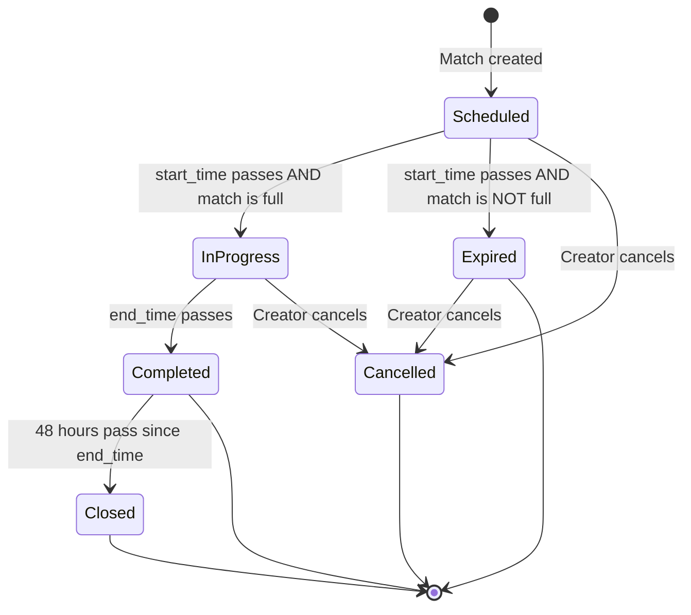
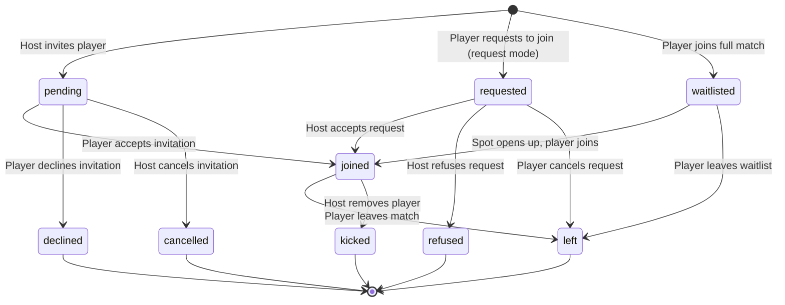

# Match Lifecycle

## Overview

Complete flow from match creation to completion, including participant management, join modes, and match state transitions.

## Match States

Match states are **derived** from match attributes (not stored in database). Status is computed based on:

- `cancelled_at`: If set, match is cancelled
- `start_time` / `end_time`: Time-based state transitions
- `match_date` / `timezone`: For accurate time calculations
- Participant count: Number of `joined` participants vs. match capacity (format: singles=2, doubles=4)

**Key Rule:** Only matches that are **full at start_time** can transition to `in_progress`, `completed`, or `closed`. Matches that are not full at start_time become `expired` and remain in that terminal state. Since match composition cannot change after start_time, a match that is full at start_time remains full throughout.

### State Definitions

| State         | Condition                                                              | Description                                                      |
| ------------- | ---------------------------------------------------------------------- | ---------------------------------------------------------------- |
| `scheduled`   | Default                                                                | Match hasn't started yet (start_time hasn't passed)              |
| `in_progress` | start_time passed AND end_time hasn't AND match was full at start_time | Match is currently happening                                     |
| `expired`     | start_time passed AND match was NOT full at start_time                 | Match start time passed but not enough players joined (terminal) |
| `completed`   | end_time passed AND match was full at start_time                       | Match ended successfully                                         |
| `closed`      | 48 hours have passed since end_time AND match was full at start_time   | Match is archived (48h after end_time)                           |
| `cancelled`   | cancelled_at IS NOT NULL                                               | Match was cancelled by creator                                   |

**Important:** `in_progress`, `completed`, and `closed` states can only occur if the match is **full at start_time**. If a match is not full when start_time passes, it becomes `expired` and remains in that terminal state.

**Priority Order:**

1. `cancelled` (if cancelled_at is set)
2. `expired` (if start_time passed AND match was NOT full at start_time) - **terminal state**
3. `closed` (if 48 hours have passed since end_time AND match was full at start_time)
4. `completed` (if end_time passed AND match was full at start_time)
5. `in_progress` (if start_time passed AND end_time hasn't AND match was full at start_time)
6. `scheduled` (default)

**State Determination Logic:**

- First check if match was full **at start_time** (snapshot at that moment)
- If NOT full at start_time → `expired` (terminal, no further transitions)
- If full at start_time → can progress through `in_progress` → `completed` → `closed`

### Match Fullness Calculation

A match is considered **full** when:

- Total capacity = format-based (singles: 2 players, doubles: 4 players)
- Current participants = count of participants with `joined` status (including creator)
- Match is full when: `current >= total`

**Note:** Only participants with `joined` status count toward match capacity. Participants with `pending`, `requested`, `waitlisted`, or other statuses do not fill spots.

## Participant Statuses

Each participant has a status that tracks their relationship to the match:

| Status       | Description                                      | Who Can Set                                    | Transitions From                     |
| ------------ | ------------------------------------------------ | ---------------------------------------------- | ------------------------------------ |
| `pending`    | Invited by host, awaiting response               | Host (via invite)                              | -                                    |
| `requested`  | Player requested to join, awaiting host approval | Player (in request mode)                       | -                                    |
| `joined`     | Actively participating                           | Player (direct join) or Host (accepts request) | `pending`, `requested`, `waitlisted` |
| `waitlisted` | On waitlist for full match                       | System (when match is full)                    | -                                    |
| `declined`   | Player declined an invitation                    | Player                                         | `pending`                            |
| `refused`    | Host refused a join request                      | Host                                           | `requested`                          |
| `left`       | Voluntarily left the match                       | Player                                         | `joined`, `requested`, `waitlisted`  |
| `kicked`     | Removed by host                                  | Host                                           | `joined`                             |
| `cancelled`  | Invitation cancelled by host                     | Host                                           | `pending`                            |

### Participant Status Flow

## Join Modes

Matches support two join modes that determine how players can participate:

### Direct Join Mode (`join_mode: 'direct'`)

- Players can join immediately without approval
- When player joins → status becomes `joined`
- First-come-first-served basis
- If match is full → status becomes `waitlisted`

### Request Mode (`join_mode: 'request'`)

- Players must request to join
- When player requests → status becomes `requested`
- Host receives notification
- Host can accept (→ `joined`) or refuse (→ `refused`)
- If match is full → status becomes `waitlisted` (can still request)

## Match Creation & Invitations

### Creating a Match

1. Creator sets match details (date, time, location, format, etc.)
2. Creator chooses join mode (direct or request)
3. Creator can invite specific players or make match public
4. Invited players receive `pending` status

### Inviting Players

- Host can invite players at any time (before match starts)
- Invited players receive `pending` status
- Host can cancel invitations (→ `cancelled` status)
- Host can resend invitations (for `pending` or `declined` players)

## Joining a Match

### Direct Join Mode

1. Player taps "Join Now"
2. If match has spots:
   - Status → `joined`
   - Both creator and player notified
3. If match is full:
   - Status → `waitlisted`
   - Player notified they're on waitlist

### Request Mode

1. Player taps "Request to Join"
2. Status → `requested`
3. Host receives notification
4. Host can:
   - Accept → Status → `joined`
   - Refuse → Status → `refused`

### Accepting Invitations

1. Player with `pending` status taps "Accept Invitation"
2. If direct join mode and spots available:
   - Status → `joined`
3. If request mode:
   - Status → `requested` (still needs host approval)
4. If match is full:
   - Status → `waitlisted`

## Leaving & Cancellation

### Player Leaves Match

- Player with `joined` status can leave at any time (before match starts)
- Status → `left`
- Creator notified
- Spot becomes available (waitlisted players can join)

### Player Cancels Request

- Player with `requested` status can cancel their request
- Status → `left`
- Host notified

### Host Kicks Participant

- Host can remove `joined` participants
- **Restriction:** Cannot kick within 24 hours of start_time
- Status → `kicked`
- Player notified
- Spot becomes available

**Rationale:** Prevents last-minute removals that leave players stranded.

### Match Cancellation

- Only creator can cancel entire match
- Sets `cancelled_at` timestamp
- Match state → `cancelled`
- All participants notified
- No further actions allowed (join, leave, edit)

**Note:** Creators cancel matches; they do not "leave" them. If a creator no longer wants to participate, they must cancel the entire match.

### Late Cancellation Penalties

Reputation penalties (`match_cancelled_late`, -25 impact) apply based on whether the match was planned in advance or created spontaneously.

#### For Creators Cancelling Within 24h of Start Time

| Condition                                    | Penalty Applied?                           |
| -------------------------------------------- | ------------------------------------------ |
| Match created **more than 24h** before start | **YES** (-25) - Others planned around it   |
| Match created **less than 24h** before start | **NO** - Spontaneous match, no commitments |

#### For Participants Leaving Within 24h of Start Time

| Condition                                                    | Penalty Applied?                                |
| ------------------------------------------------------------ | ----------------------------------------------- |
| Match is **full** AND created **more than 24h** before start | **YES** (-25) - Committed spot on planned match |
| Match is **not full**                                        | **NO** - No one is stranded                     |
| Match created **less than 24h** before start                 | **NO** - Last-minute match, flexible commitment |

**Rationale:** This protects against last-minute bailouts on planned matches while allowing flexibility for spontaneous, last-minute matches. Players who make others commit and then bail are penalized, but impromptu matches remain low-commitment.

**Implementation Notes:**

- The `created_at` timestamp on the match record is used to determine if the match was planned (>24h before start) or spontaneous (<24h before start)
- If a match's date/time is edited, the `last_modified_at` timestamp is also considered
- Penalty events are created immediately when the participant leaves or creator cancels

## Match Progression

### Before Match Starts (`scheduled`)

- Players can join/leave
- Host can edit match details
- Host can invite/kick participants
- Host can accept/reject requests

### During Match (`in_progress`)

- Match is happening (between start_time and end_time)
- Match is full (was full at start_time, composition cannot change)
- No join/leave actions allowed
- No editing allowed
- Limited UI actions (view only)
- **Check-in available** (see Check-In section)

### Match Expired (`expired`)

- Start time has passed but match is NOT full
- Match did not get enough players before start time
- **Terminal state** - match remains expired forever (does not transition to closed)
- No join/leave actions allowed (too late to join)
- No editing allowed
- Match is considered unsuccessful
- Cannot transition to `in_progress`, `completed`, or `closed` states

### After Match Ends (`completed`)

- Match has ended (end_time passed AND match is full)
- Match completed successfully
- No join/leave actions allowed
- Results can be recorded
- Feedback can be collected

### Match Closed (`closed`)

- 48 hours have passed since end_time AND match is full
- Match is archived
- No actions allowed
- Historical record only
- Only matches that were full at start_time can reach this state

## Match Reminders

All `joined` participants receive reminders before their match:

| Timing            | Channel      | Content                                           |
| ----------------- | ------------ | ------------------------------------------------- |
| 24 hours before   | Push + Email | Full match details (location, time, participants) |
| 2 hours before    | Push         | "Your match is coming up!"                        |
| 10 minutes before | Push         | Check-in request with location verification       |

See [Notifications](../08-communications/notifications.md) for full notification specifications.

## Check-In

### Overview

Players can check-in to confirm their physical presence at the match location.

### Availability

- Available **from 10 minutes before start_time to end_time**
- The 10-minute pre-match window coincides with the check-in reminder notification
- Optional - not required to complete the match

### How It Works

1. Player receives check-in reminder (10 minutes before start)
2. Player opens match detail during the check-in window
3. System verifies player's location against match coordinates
4. If within acceptable radius (e.g., 100m), `checked_in_at` timestamp is recorded on the participant record
5. Check-in status visible to all participants

### Data Model

| Field           | Type      | Description                                         |
| --------------- | --------- | --------------------------------------------------- |
| `checked_in_at` | timestamp | When the player checked in (null if not checked in) |

Check-in state is derived:

- `checked_in_at` is NULL → not checked in
- `checked_in_at` is set → checked in at that time

## Sharing Matches

### In-App Sharing (Creator Only)

Match creators can share matches to groups and communities within Rallia:

- Available any time before match starts
- Share to groups the creator belongs to
- Share to communities the creator belongs to

### Social Media Sharing

Both creators and participants can share match details to external platforms:

| Who         | Can Share                    |
| ----------- | ---------------------------- |
| Creator     | Any time before match starts |
| Participant | Any time before match starts |

**How It Works:**

- Generates shareable link/card
- Shows: Date, time, location, format, spots available
- Link opens match in app (or app store if not installed)

**Platforms:** Native share sheet (iOS/Android)

## Waitlist Behavior

### When Match is Full

- New join attempts → `waitlisted` status
- Players remain on waitlist until spot opens
- **No ordering:** Waitlist has no priority order (not FIFO, not by reputation)

### When Spot Opens

- All waitlisted players receive a notification that a spot is available
- Players must actively join when notified (no auto-join)
- First player to respond gets the spot
- If direct join mode: Status → `joined` immediately
- If request mode: Status → `requested` (still needs host approval)

### Leaving Waitlist

- Waitlisted players can leave the waitlist at any time (before match starts)
- Status → `left`
- No notification to creator (reduces noise)

## Multi-Recipient Invitations

When match is sent to multiple players:

- Each invited player gets `pending` status
- First to accept gets the spot (if direct join)
- Others remain `pending` until:
  - They accept (if spots available)
  - They decline (status → `declined`)
  - Host cancels their invitation (status → `cancelled`)

## Notifications Summary

| Event                        | Creator Notified     | Participant Notified        |
| ---------------------------- | -------------------- | --------------------------- |
| Player joins (direct)        | ✅ Yes               | ✅ Confirmation             |
| Player requests to join      | ✅ Yes               | ✅ Confirmation             |
| Request accepted             | ✅ Confirmation      | ✅ Yes                      |
| Request refused              | ✅ Confirmation      | ✅ Yes                      |
| Invitation declined (single) | ✅ Yes               | N/A                         |
| Invitation declined (multi)  | ❌ No (check status) | N/A                         |
| Player leaves                | ✅ Yes               | ✅ Confirmation             |
| Player kicked                | ✅ Confirmation      | ✅ Yes                      |
| Match cancelled              | N/A                  | ✅ Yes (all participants)   |
| Spot opens (waitlist)        | N/A                  | ✅ Yes (waitlisted players) |

## Schedule Conflicts

### Detection

When player tries to join:

- System checks calendar for conflicts
- If conflict found, shows warning

### Behavior

| Scenario             | Action                       |
| -------------------- | ---------------------------- |
| Conflict detected    | Warn player, allow override  |
| Player joins anyway  | Their responsibility         |
| Creator not informed | Conflict is receiver's issue |

## Non-User Acceptance

When someone not on the app accepts:

1. They provide: Name, Email, Phone
2. They receive calendar confirmation
3. They're prompted to install app
4. Their info goes to growth mailing list
5. They can participate in match chat via web (or app if installed)

> **Growth Hack:** Converts non-users to users.

## Match Chat

Match chat is available for coordinating match details (meeting point, equipment, etc.).

### Availability

- **Only `joined` participants** can access match chat
- Chat becomes available immediately when a player's status becomes `joined`
- Players with `pending`, `requested`, or `waitlisted` status cannot access chat
- Chat remains accessible until match is `closed`

### Content

- Text messages only
- All `joined` participants see all messages
- No moderation (but can be reported via match feedback)

See [Communications](../08-communications/chat.md) for full chat specifications.
