# Most Wanted Player

> **Growth Hack:** The ultimate player badge combining skill certification and reliability.

## Definition

The "Most Wanted Player" super-badge is awarded to players who have BOTH:

1. **Certified Level Badge** (verified skill)
2. **High Reputation Badge** (90%+ reputation)

## Display

```
┌─────────────────────────────────────────┐
│ 🌟 MOST WANTED PLAYER                   │
│                                         │
│ Jean Dupont                             │
│ NTRP 4.0 ✓ • Reputation 94% ⭐          │
│                                         │
│ Certified skill + Excellent reliability │
└─────────────────────────────────────────┘
```

### Badge Appearance

| Location       | Display                                       |
| -------------- | --------------------------------------------- |
| Profile        | 🌟 or crown icon + "Most Wanted Player" label |
| Search results | Special badge indicator                       |
| Player cards   | Prominent highlighting                        |

## Daily Email Announcement

### Trigger

Once per day, the app sends an email to all players:

### Content

```
Subject: [Rallia] Today's New Most Wanted Players

Hi [Name],

Meet today's new Most Wanted Players! These players have
proven their skill AND reliability:

🎾 Tennis
- Jean Dupont (NTRP 4.0) - Montreal
- Marie Leblanc (NTRP 3.5) - Toronto

🏓 Pickleball
- Pierre Martin (DUPR 4.5) - Vancouver

Want to join them? Get your level certified and maintain
your reputation above 90%!

[Find a Match] [View My Profile]
```

### Logic

- Only include players who earned the badge TODAY
- Separate by sport
- Skip days with no new Most Wanted Players

## Earning the Super-Badge

```mermaid
flowchart TD
    A[Player] --> B{Has Certified Level?}
    B -->|No| C[Get certified first]
    B -->|Yes| D{Reputation >= 90%?}
    D -->|No| E[Improve reputation]
    D -->|Yes| F[🌟 MOST WANTED PLAYER!]
    C --> B
    E --> D
```



## Losing the Super-Badge

Lost if either component badge is lost:

- Level certification revoked → super-badge removed
- Reputation drops below 90% → super-badge removed

Can be re-earned by regaining both badges.

## Benefits

### For Most Wanted Players

- High visibility in search
- Matches they create get "Most Wanted Game" badge
- Social proof and prestige

### For the Platform

- Incentivizes good behavior
- Creates aspirational goal
- Content for email engagement

## Most Wanted Game Badge

Matches created by Most Wanted Players with court already reserved receive the "Most Wanted Game" badge.

See [Match Badges](./match-badges.md).
