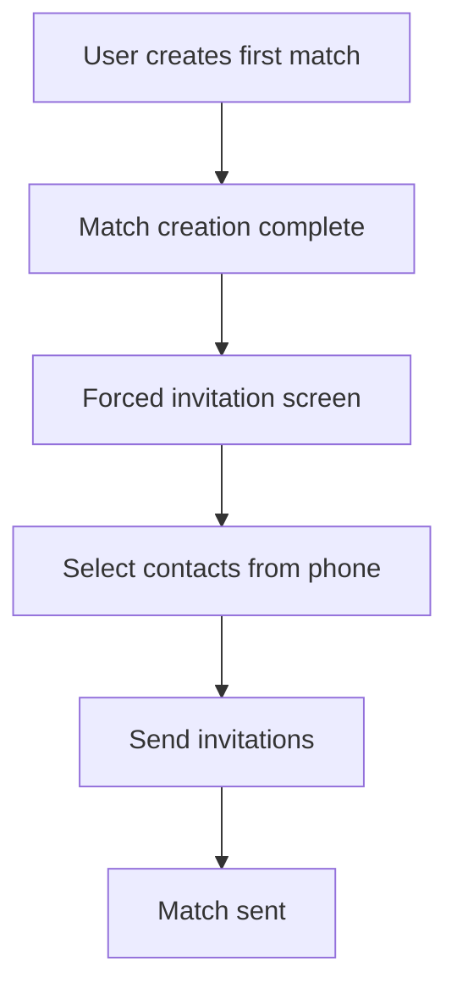

# Invitation Mechanics

## Overview

Multiple touchpoints where users invite others to join Rallia.

## First Match Invitation (Forced)

> **Growth Hack:** At first match creation, users must send invitations.

### Trigger

When a user creates their very first match.

### Flow



### Screen

```
┌─────────────────────────────────────────┐
│ Invite Friends to Rallia!               │
│                                         │
│ Your match is ready, but Rallia is more │
│ fun with friends!                       │
│                                         │
│ Select at least 3 contacts to invite:   │
│                                         │
│ [Search contacts...]                    │
│                                         │
│ ☑ Jean Dupont                           │
│ ☑ Marie Leblanc                         │
│ ☐ Pierre Martin                         │
│ ...                                     │
│                                         │
│ [Send Invitations (2 selected)]         │
└─────────────────────────────────────────┘
```

### Requirements

- Minimum 3 contacts selected (configurable)
- One-time gate (not shown again)
- Reference: Splitwise onboarding

## Anytime Invitation

### Access

- Settings → Invite Friends
- Share icon in app header
- "Invite" button on empty states

### Options

| Method    | Description                |
| --------- | -------------------------- |
| Contacts  | Select from phone contacts |
| SMS       | Compose SMS with link      |
| Email     | Compose email with link    |
| Social    | Share to social apps       |
| Copy Link | Copy invite link           |

## Invitation Message

### Template

```
Hey! I'm using Rallia to find tennis/pickleball matches.
Join me and let's play!

Download: [link]
```

### Customization

Allow users to personalize the message.

## Tracking

### Unique Links

Each user gets a unique referral link:

```
https://rallia.app/invite/user123
```

### Attribution

When new user signs up via link:

- Track referrer
- Credit referral (if rewards active)

## Non-User Capture

When inviting non-app users to matches:

1. Match invitation sent via SMS/email
2. If they accept, they provide contact info
3. Contact info added to mailing list
4. Automatic invitation emails sent periodically

See [Referral System](./referral-system.md).
