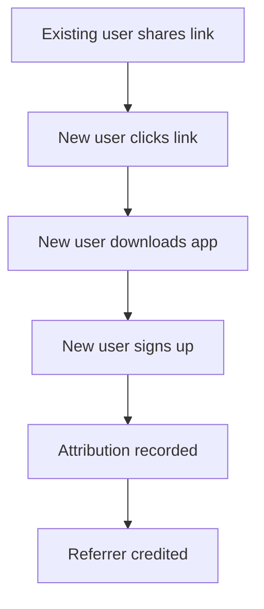

# Referral System

## Overview

Track and optionally reward users for bringing new players to Rallia.

## Referral Tracking

### Unique Referral Link

Each user has a personal referral link:

```
https://rallia.app/join/johndoe
```

### Attribution Flow



### Attribution Window

- Default: 7 days from click to signup
- Configurable based on data

## Mailing List Integration

### Contact Sources

| Source           | Collection Point                           |
| ---------------- | ------------------------------------------ |
| Private Lists    | When user creates list of non-app contacts |
| Match Acceptance | When non-user accepts a match              |
| Voluntary Signup | Email signup on website                    |
| Partnerships     | Imported lists (with consent)              |

### Automatic Invitations

Periodic emails to mailing list:

```
Subject: Jean invited you to play on Rallia!

Hi [Name],

Your friend Jean Dupont thinks you'd love Rallia -
the app for finding tennis and pickleball matches.

Players in your area are looking for partners.
Join now and find your next match!

[Download Rallia]

Not interested? [Unsubscribe]
```

### Email Cadence

- Initial: Within 24h of being added to list
- Follow-up: Weekly for 4 weeks
- Then: Monthly until unsubscribe

## Referral Rewards (Future)

### Reward Ideas

| Reward          | Trigger        |
| --------------- | -------------- |
| Badge           | First referral |
| Premium Feature | 5 referrals    |
| Merchandise     | 10 referrals   |
| Cash/Credit     | TBD            |

### Referral Dashboard

```
┌─────────────────────────────────────────┐
│ My Referrals                            │
├─────────────────────────────────────────┤
│ Total Invited: 15                       │
│ Signed Up: 4                            │
│ Active Players: 3                       │
│                                         │
│ Your Link: rallia.app/join/johndoe      │
│ [Copy] [Share]                          │
└─────────────────────────────────────────┘
```

## Privacy & Compliance

### Email List Management

- Clear unsubscribe in every email
- Honor unsubscribe requests immediately
- Comply with CASL (Canada), CAN-SPAM (US)
- Don't share lists externally

### Contact Import

- Only import with user action
- Explain what will happen with contacts
- Allow review before sending
