# Rallia App Specifications

> Comprehensive product specifications for the Rallia Tennis & Pickleball app.

## Quick Navigation

| #                                     | System                      | Description                                            | Phase |
| ------------------------------------- | --------------------------- | ------------------------------------------------------ | ----- |
| [01](./01-authentication/README.md)   | Authentication & Onboarding | User entry, sport selection, profile creation          | 1     |
| [02](./02-sport-modes/README.md)      | Sport Modes                 | Tennis/Pickleball interface separation and switching   | 1     |
| [03](./03-settings/README.md)         | Settings                    | Profile management, preferences, account configuration | 1     |
| [04](./04-player-rating/README.md)    | Player Rating               | NTRP/DUPR skill levels, certification, level evolution | 1     |
| [05](./05-reputation/README.md)       | Reputation                  | Behavioral scoring based on reliability and conduct    | 1     |
| [06](./06-player-directory/README.md) | Player Directory            | Browse, search, and view player profiles               | 2     |
| [07](./07-player-relations/README.md) | Player Relations            | Favorites, groups, communities, blocking               | 2     |
| [08](./08-communications/README.md)   | Communications              | Chat, notifications, moderation                        | 2     |
| [09](./09-matches/README.md)          | Matches                     | Full match lifecycle from creation to closure          | 3     |
| [10](./10-club-portal/README.md)      | Club Portal                 | Private clubs: profiles, availability, bookings        | 4     |
| [11](./11-courts/README.md)           | Courts                      | Court discovery and reservation integrations           | 4     |
| [12](./12-calendar/README.md)         | Calendar                    | In-app and external calendar management                | 3     |
| [13](./13-gamification/README.md)     | Gamification                | Badges and achievement system                          | 5     |
| [14](./14-growth/README.md)           | Growth                      | Viral mechanics, invitations, sharing                  | 5     |
| [15](./15-admin/README.md)            | Admin Portal                | GOD MODE - full system control                         | 6     |
| [16](./16-analytics/README.md)        | Analytics                   | Metrics and reporting dashboards                       | 6     |

## Development Phases

```mermaid
flowchart LR
    subgraph P1 [Phase 1: Foundation]
        A1[01 Auth]
        A2[02 Sport Modes]
        A3[03 Settings]
        A4[04 Rating]
        A5[05 Reputation]
    end

    subgraph P2 [Phase 2: Discovery]
        B1[06 Directory]
        B2[07 Relations]
        B3[08 Comms]
    end

    subgraph P3 [Phase 3: Core Loop]
        C1[09 Matches]
        C2[12 Calendar]
    end

    subgraph P4 [Phase 4: Venues]
        D1[10 Club Portal]
        D2[11 Courts]
    end

    subgraph P5 [Phase 5: Engagement]
        E1[13 Gamification]
        E2[14 Growth]
    end

    subgraph P6 [Phase 6: Operations]
        F1[15 Admin]
        F2[16 Analytics]
    end

    P1 --> P2 --> P3 --> P4 --> P5 --> P6
```

| Phase              | Systems | Rationale                                                          |
| ------------------ | ------- | ------------------------------------------------------------------ |
| **1 - Foundation** | 01-05   | Core player identity: who they are, their skill, their reliability |
| **2 - Discovery**  | 06-08   | Players discover, connect, and communicate with each other         |
| **3 - Core Loop**  | 09, 12  | The MVP value: create and schedule matches                         |
| **4 - Venues**     | 10-11   | Club management (supply) + court discovery (demand)                |
| **5 - Engagement** | 13-14   | Badges, achievements, viral mechanics                              |
| **6 - Operations** | 15-16   | System control and insights                                        |

## Design Principles

See [principles.md](./principles.md) for the guiding design principles of the application.

## Document Structure

Each system folder contains:

- `README.md` - System overview, user stories, dependencies
- Feature-specific markdown files for detailed specifications

## References

- [Original MVP Specs](../MVP_SPECS.md) - Initial draft document
